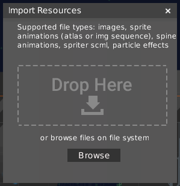

HyperLap2D supports a wide variety of assets. To import something into your project navigate to `Resources → Import Resources`.

### Supported files

- `PNG` image files
- libGDX's Sprite Animation Atlas
- PNG sequenze animation (batch of PNG files in the format `name_xx.png`, where `xx` is a number, will be recognized as an animation).
- libGDX's particle effects.
- Spine Animations (see [Spine Extension](libgdx-Spine-extension))
- GLSL shaders (You need to import both `.frag` and `.vert` files)
- HyperLap2D Library (see [Import Library Items](Import-Export-Library-items))

You can import multiple files by drag and drop assets into panel.

Once imported, your assets will appear in [Resources Panel](Editor-UI#resource)