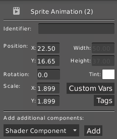
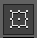
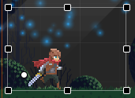
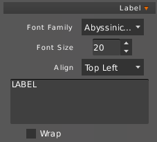
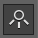
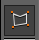
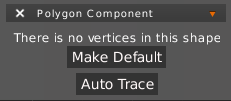
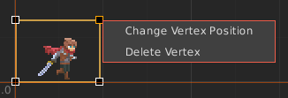

Tools allow to manipulate objects on the screen.

## Pan Tool

To move around your scene either drag with middle click or press space and drag scene.

##  Selection Tool

Shortcut : `V`

Select and move objects on the scene. You can select multiple object by click while holding `Maiusc` button.

#### Basic Properties

- `Identifier` : Unique string name that describe the object.

- `Position` : Current position on the scene.

- `Rotation` : Current rotation.

- `Scale` : Current scale.

- `Tint` : Change the color of the object, if supported.

#### Custom variables and Tags

Each object could have a set on `Custom Variables` and `Tags` that may help to build game logic.

Additional properties will appear according to selected object's type.

##  Transform Tool

Shortcut : `Ctrl + T`

Allow to scale, rotate and move objects

The white dot represents the `Origin` position.

##  Text Tool

Place a `Label` on the scene. A `Label` has multiple properties.

Labels support typing and additional effects through [TypingLabel library](https://github.com/rafaskb/typing-label). Add `Typing Label` additional component to enable.

##   Light Tools

You can place `Point` and `Cone` lights, more info in [Lights](Lights)

##  Polygon Tool

With this tool you can edit a custom polygon shape for selected object. It requires a valid `Polygon Component` attached to the object.

By default `Polygon Component` is empty.

- `Make Default` will create a basic square shape around the object.

- `Auto Trace` try to recognize edges of the image and create a custom shape around it (works only for Image type).

You can manipulate a single vertex or a selection of vertices with mouse. You can also fine-tune vertices with a right mouse click.

