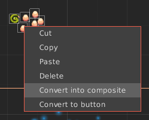
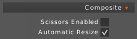
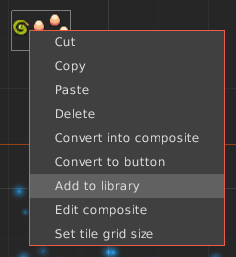

Multiple objects can be grouped in a _Composite_. Right click on a selection and hit `Convert into Composite`.

To edit a Composite just double click on it.

#### Properties

- `Scissors Enabled` : Allow to enable [scissors stack](https://github.com/libgdx/libgdx/wiki/Clipping,-with-the-use-of-scissorstack) on this composite.

- `Automatic Resize` : Automatically resize composite bounds to match objects inside, disable before edit with [transform tool](Basic-Tools#-transform-tool)

## Library

A Composite can be stored as a _Library Item_. You can replicate the same Composite as much as you want. All Library Items are linked, any modification will be propagated to any instance.

To create a Library Item right click on a Composite object and hit `Add to library`.

Library Items will appear in [Resources Panel](Editor-UI#resource).