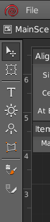
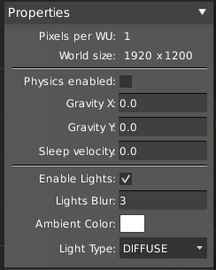

Editor is composed by:
- [Menu bar](#menu-bar)
- [Scene hierarchy](#scene-hierarchy)
- [Sandbox](#sandbox)
- [Toolbox](#toolbox)
- [Panels](#panels)

## Menu bar

Here you can find common controls over the project and the program itself. Functionalities of this bar can be extended with [plugins](Plugin-System).

## Scene hierarchy

Indicate current scene and active composite hierarchy showed in the Sandbox.

## Sandbox

The Sandbox is the main part of HyperLap2D. Here you can graphically place all your assets and compose the scene. The Sandbox can be also focused on a single composite.

### Guidelines

You can place guidelines by dragging from rule to the scene.

You can fine tune position of a single line too. Right click on a line and choose `Change Ruler Position`

Guidelines position can be locked in the current position by checking `Lock lines`.

### Sandbox toolbar

- `Scene` : Manage [multiple scenes](Multiple-Scenes).

- `Lock lines` : Lock guidelines at current position.

- `Grid size` : Size of the virtual grid size to align elements.

- `Zoom` : Control Sandbox's zoom (you can use [shortcuts](Shortcuts) too).

- `Resolution` : Manage [multiple resolutions](Multiple-Screen-Resolutions).

- `Repack` : Perform a repacking of all assets for all resolutions.

- `Live Preview` : Open the Live Preview window.

### Toolbox

In the Toolbox you can find all tools that you can use in HyperLap2D. Functionalities of this bar can be extended with [plugins](Plugin-System).

Learn more at [Basic Tools](Basic-Tools) page.

### Panels

With Panels you can control everything on your scene. Default pannels can be collapsed and has a fixed position. Additional panel can be dragged all over the screen.

List of default panels:

#### Align
Easy align multiple selected items

#### Items Tree

Shows all items in current scene. The order of the tree represent `Z-Index` order in the scene.

You can control `Z-Index` with [shortcuts](Shortcuts).

#### Properties

Properties panel changes based on which item is selected. If you want to change scene properties click on a empty space.

_Scene_

Here you can see some useful info about the World units. Setting for [physic](Physics) and [lights](Lights).

HyperLap2D uses [`Box2D`](https://github.com/libgdx/libgdx/wiki/Box2d) and [`Box2DLights`](https://github.com/libgdx/box2dlights) respectively for physics and lights.

#### Resource

All imported resources will be showed in this panel.

It's divided in sections for: `Images`, `Animations`, `Particle Effects` and `Library Items`.
You can insert elements into scene by drag and drop any item from this panel to Sandbox.

#### Layers

You can use Layers in order to organize better your scene. A layer can be hided or locked when necessary. Elements in a locked layer cannot be selected.

Items dropped from [Resource](#resource) will be put into current selected layer.
Every [composite](Composite-Items) has its own layer list. There will be always a layer, the `Default` one is autogenerated and cannot be removed.

You can add as many layers as you want. You can also re-organize z-index by drag and drop layers in this panel.

To rename a layer double click on it.