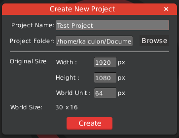

HyperLap2D is a powerful, platform independent, visual editor for complex 2D worlds and scenes. It helps to create scenes without hard-coding positions, and supports different screen resolutions.

Currently HyperLap2D support these runtimes:
- [libGDX Runtime](libgdx---Getting-Started)

## Screen, Resolution and World

HyperLap2D can manage resolution automatically for all your assets. It's important to set up your project correctly to the get the best result.

## Creating New Project

To create a new project, navigate to `File → New Project`

- `Project Name` : Name of your amazing project.

- `Project Folder` : Location where you want to save the project.

- `Width` and `Height` : This is the maximum resolution of your assets. The will be automatically scaled down for lower resolutions.

- `World Unit` : You can specify how many pixels should be 1 World Unit, choose 1 to work with pixels.

- `World Size` : The size of the virtual world screen calculated from _width_, _height_ and _world unit_.

Click `Create` to open your new empty project.