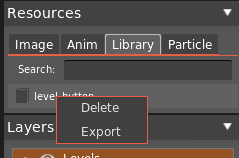

You can export and import [Library Items](Composite-Items#library) into `.h2dlib` format.

#### Export

`Right click + Export` on a Library Item

#### Import

Use [Import Panel](Assets). HyperLap2D takes care of different resolutions and world unit.