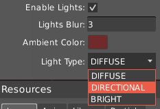
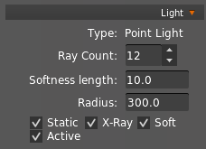
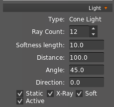
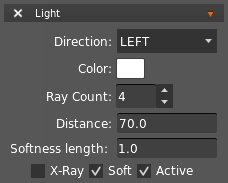
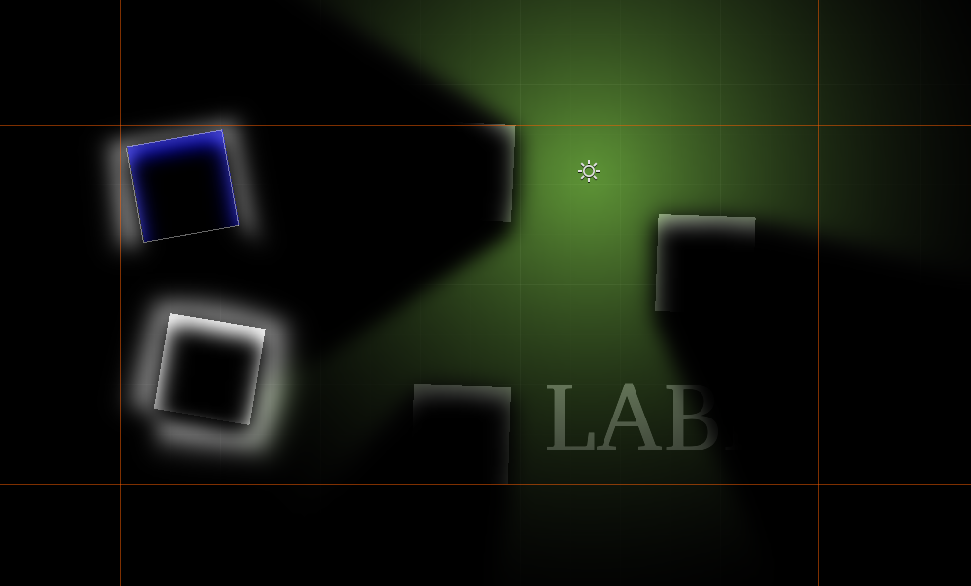

HyperLap2D uses [Box2DLights](https://github.com/libgdx/box2dlights) to simulate a realistic light system together with [Physics](Physics).

Ambient light can be controlled in Scene Properties panel.

You have three type of Ambient Light:

- `Diffuse` 

- `Directional`

- `Bright`

Learn more on box2DLights [wiki](https://github.com/libgdx/box2dlights/wiki).

### Light up the scene

You can add as many lights you need in your scene with Point and Cone Light tools. All settings can be controlled in properties:

 

- `Type` : The type of the current selected light

- `Ray count` : The number of light rays (more rays gives more realistic effect)

- `Softness Length` : The softness value for beams tips

- `Static` : Set static light

- `X-Ray` : Allow light to pass through Box2D bodies

- `Soft` : Set soft light

- `Active` : Enable or disable the light

#### Point Light

- `Radius` : The radius of the light circle

#### Cone Light

- `Distance` : The max distance of the light

- `Angle` : The angle size (in deg) of the light cone

- `Direction` : The direction (in deg) of the light cone

Lights may have different colors. You can control the tint in [Basic Properties](Basic-Tools#basic-properties).

#### Body Lights

You can also attach to a physic body a chain light to create some cool effects. Add an additional `Light` component to an object that has both `Physics` and `Polygon`.

### Example

