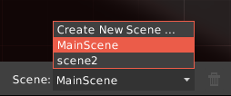
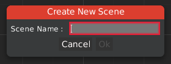

HyperLap2D can handle multiple scenes inside the same project. Each Scene share all assets and libraries.

All scenes are saved in different files.

Scenes can be switched or deleted in the [Sandbox toolbar](Editor-UI#sandbox-toolbar). `MainScene` is the default generated one and cannot be deleted.

