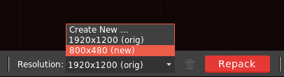

HyperLap2D is able to manage automatically different resolutions. The default one `orig` is automatic generated and cannot be deleted. Additional resolution could be added in Sandbox bar.

There is no restriction while create a new resolution, HyperLap2D will automatically scale all your assets and atlases. However, is highly recommended to only downscale your `orig` resolution. It's important to choose the right working resolution during initial [project setup](Getting-Started).