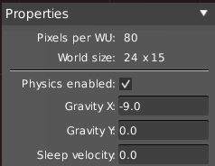
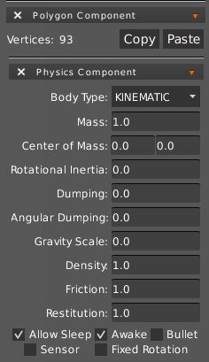

HyperLap2D uses [Box2D](https://box2d.org/) to simulate a realistic physics system.

Basic Physics settings can be found in Scene Properties panel.

### Box2D Body

To create a Box2D Body you have to attach to an object both `Physics` and `Polygon` Components.

Runtime will attach automatically a `Polygon Shape` to the body in according to `Polygon Component`.