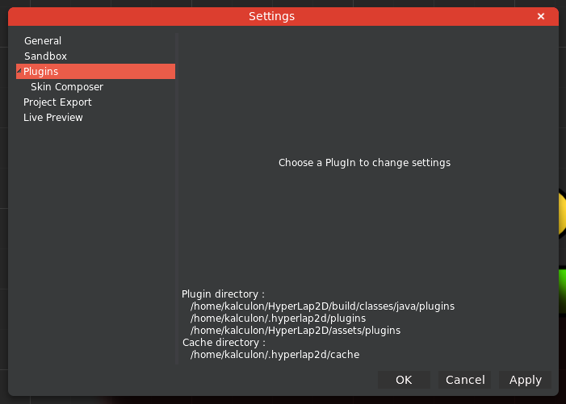

With Settings you can manage both Editor, PlugIns and Project common settings. Navigate to `File → Settings`:

### Project Export

In `Project Export` setting you can manage the export asset folder (of your game) and some settings for Texture Packer. HyperLap2D will pack all of your images into a single `.atlas` file in order to save space in the final result.

### PlugIns

Additional Settings may appear for a particular plugin.

According to your OS and intallation directory, HyperLap2D will scan the listed directories for plugins as well as for the cache directory used to store temporary files.