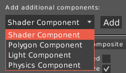
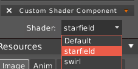
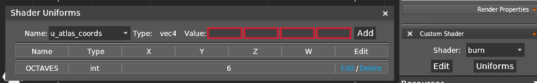
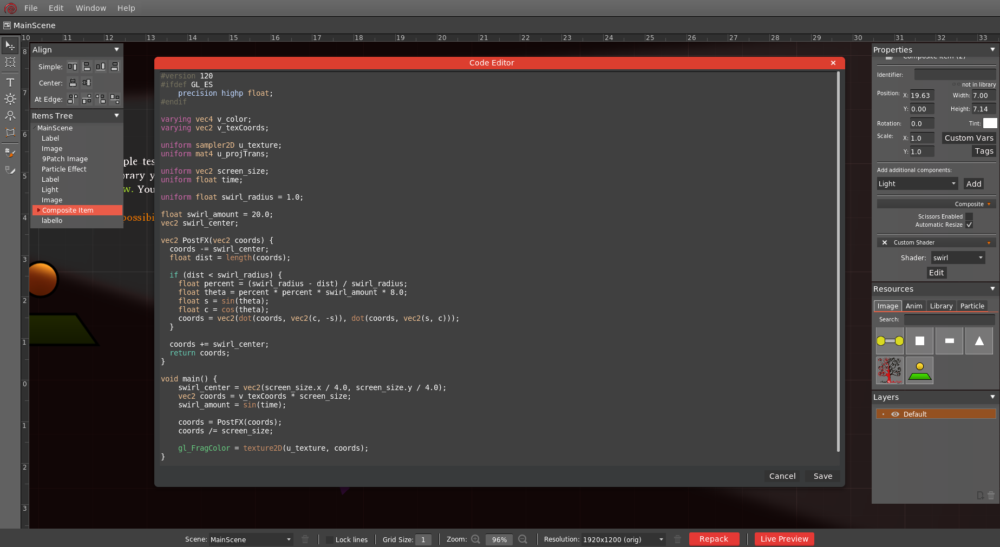

Custom GLSL Shaders can be add to any object, including [Composites](Composite-Items).

When import both `<name>.frag` and `<name>.vert` you'll be able to set a shader with `Shader Component` properties.

**Uniform variables**

Custom uniform variables can be passed to Shader Component with `Uniforms` panel.

**Default Uniform variables**

HyperLap2D pass some default uniforms to any shader:
- `u_time` : **float** time passed since renderer is started
- `u_delta_time` : **float** delta time between frames
- `u_atlas_coords` : **vec4** U, V, U2 and V2 coordinates of the region in texture atlas (if Entity has a `TextureRegionComponent` attached)

### Fragment Shader Editor

You can edit Fragment Shaders directly into HyperLap2D and watch changes in real time. Click the `Edit` button in `Shader Component` properties to open Code Editor. 

